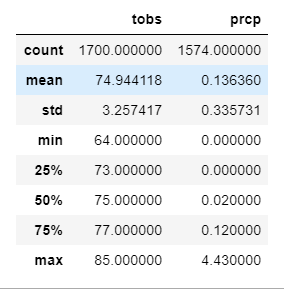
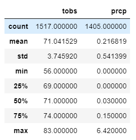
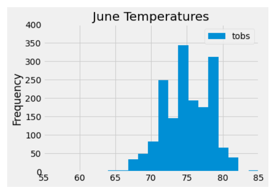
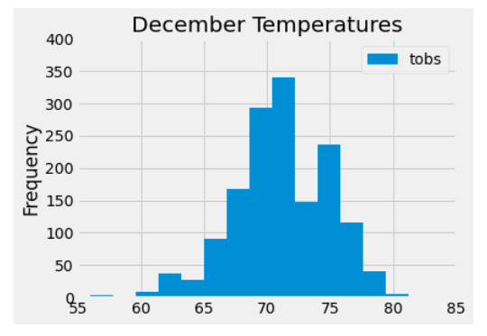

# Surf's Up
Surf's Up with Advanced Data Storage and Retrieval

## Overview:
W. Avy wants more information about temperature and precipitation trends before investing in your the surf shop. Specifically, he wants temperature data for the months of June and December in Oahu, in order to determine if the surf and ice cream shop business is sustainable year-round.

## Results:
### June Statistics for the Temperature and Precipitation

### December Statistics for the Temperature and Precipitation

1. The mean temperature of 75°F for June is higher than the mean temperature of 71°F for December.  However, the opposite is true for precipitation.  December had the higher precipitation of .22 inches while June had .14 inches. 

2. Grouping the data into 15 bins, the histograms visually show how the frequency centers around the two different means.  For consistency of the graphs, the ranges of the axes were generated as the same for easier comparison using the minimum and maximum numbers from the descriptive statistics.  Using the same range for the temperatures, June appears to have a slight left skew, where December is more symmetrical.    

## Summary:
The investor's main concern was getting rained out too frequently.  Comparing the June and December weather patterns, the temperatures and precipitation means are reasonably close.  The temperature data is not strongly skewed for either month. The data supports opening a Surf and Ice Cream shop year-round.
